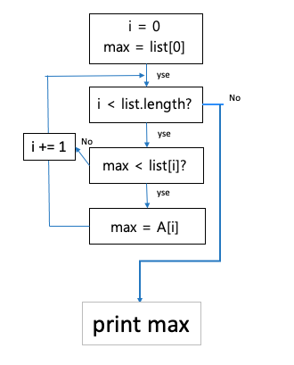

## 알고리즘이란 ?

문제를 해결하는 절차이다.

알고리즘은 **프로그래밍 언어*** 로 코드를 작성하는 모든 개발자 들이 기본적으로 알고 있어야 하는 지식으로
제한된 공간과 시간 안에서 데이터를 어떻게 처리할 것인가.를 로직 으로 정해 놓은 것 ( = 주어진 input 으로 정의된 계산을 수행하여 다음에 output <결과> 을 내는것  )<br /> 
가장 좋은 알고리즘은 제공 된 데이터를 가장 작은 데이터 공간과 빠른 시간 안에서 효울적으로 처리 할수 있는것이다.<br /> 
 |* 다양한 결과 값을 만들기 위해 여러가지 명령어를 모아 놓은 언어

<aside>
💡 흔히 우리에게 알고리즘 이란 코딩 테스트를 위해 공부 해야 하는 것이라는&#160;인식이 있지만<br /> 
　기업들은 "이사람이 알고리즘을 얼마나 이해하고 잇는지 `시간과 공간 복잡도` * 에 대한 이해가 있는지 확인하기 　위함"이다.

</aside>

나는 자바스크립트로 내용을 정리해보고자 한다.

## 알고리즘의 조건

1. 입력 데이터 Input  : 0개 이상의 외부의 입력
2. 출력 데이터 Output : 1개 이상의 출력
3. 명확성 : 모호하지 않은가
4. 유한성 : 한정된 수의 단계를 거쳐서 종료 되었는가
5. 유효성 : 컴퓨터가 수행할수 있는가.

### 알고리즘의 생성 단계

## Step 1  설계

**상향식 설계**

- 코드를 자세히 설계하고 그것들 조합하여 전체적인 알고리즘을 구성
- 부분적인 요소들을 먼저 제작하고 요소들을 결합하는 과정을 통해, 목표로 하는 결과에 접근해 가는것

**하향식 설계**

- 단계적으로 상세해 지는 것
- 알고리즘의 개요를 정하고 점차 상세화
- 자료구조를 정의하고 상세화 반복

## Step 2  표현 및 기술

일상언어   (내가 어떤 식으로 풀어 나갈지 미리정해 보는 것이 좋다.)

⭐ 순서도

의사코드 :프로그램을 작성할 때 각 모듈이 작동하는 논리를 표현하기 위한 언어

프로그래밍 언어등

예시 → 최대값을 찾는 알고리즘

```jsx
// 일상언어
1. 첫 숫자를 최댓값으로 지정
2. 다음숫자와 비교한다.
3. 비교후 더 큰 숫자를 저장한다.
4. 다음숫자로 넘어간다. (없는 경우 2로 돌아간다.)
5. 저장된 숫자를 최대 값으로 출력한다.

//의사코드
let list = [0,3,5,7,2]
let max = list[0]
for (var i = 1 ; i < list.length; i++){
	if (max < list[i]){
		max = list[i]
	}
}
console.log(max)
```

// 순서도



## Step 3  정확성 검증

수학적 검증 으로 풀이한 식이 수학적으로 맞는 값을 도출 했는지 확인

## Step 4  효율성 분석

공간 복잡도와 시간복잡도를 확인하여 메모리의 사용공간은 얼마나 되며 시간은 얼마나 효율적으로 사용하는지 확인

### 시간 복잡도 ?

알고리즘의 절대적인 실행 시간을 나타내는 것이 아닌 알고리즘을 수행하는 데 연산 들이 몇 번 이루어지는 지를 숫자로 표기

예를 들어 “양의 정수 N을 X번 반복하여 더한다.” 라고 가정해보자.

```jsx
// 1번 공식
let sum = N * X

// 2번 공식
let sum = 0
for (var i = 0; i < X; i++){
	 sum += N
}
```

1번 공식을 사용할 경우 1번의 공식 계산만 으로 답을 구할수 있는 반면

2번의 경우 X 번 반복하여 계산 하기 때문에 시간이 조금 더 걸리는 경우가 발생한다.

*** 자세한 설명은 다시 블로그를 만들어 보려 한다. (Bic O 포함)

💁🏼‍♀️ 알고리즘을 공부 할때 주요점 🔑

- input의 사이즈가 커질수록 Bic O 가 어떻게 변화 하는지
- 공간과 시간 복잡도는 어떤지
- 어떤 자료구조를 이용하여 알고리즘을 쓰는것이 좋은지 공부 하는 것이 좋다.

## 자료구조

서비스나 어플리케이션 에서 필요한 데이터를 메모리에 어떻게 구조적으로 잘 정리해서 담아두고, 관리하며,<br /> 
최종적으로 가장 효율적인 방식으로 필요한 데이터에 빠르게 접근하고, 수정, 삽입, 삭제를 할수 있도록 도와주는 것이다. 

### 자료구조의 종류

- 배열 Arrey

index, value 쌍으로 구성되어 있다. ex ) A = [1,2,3,4,5]

| index A[ n ] | 0 | 1 | 2 | 3 | 4 |
| --- | --- | --- | --- | --- | --- |
| value n | 1 | 2 | 3 | 4 | 5 |

각 원소들을 모두 같은 데이터 타입을 갖고 저장하며, 고정된 크기를 가지고 있다.<br />
각 원소의 물리적 순서(메모리 주소)가 논리적 순서(인덱스 번호)와 동일하다.<br />
첫 번째 원소의 메모리 주소로 다른 원소의 주소를 계산할 수 있다. ex ) A[n+1]등<br />
1차원 배열, 2차원 배열, 3차원 배열, ... , n차원 배열의 사용이 가능 하다.

[장점] 인덱스를 통한 직접 접근이 가능하다. ( = 어디로 접근 하든 접근 시간 동일함)<br />
[단점] 삽입 / 삭제 시 많은 양의 데이터 이동 필요 ( 데이터가 무거워진다.

- 연결리스트 Linked list

데이터와 링크를 갖는 노드로 구성됨<br />
논리적 순서와 물리적 순서가 동일하지 않음<br />
데이터 삽입/삭제가 수월하다.

요소 이름

- 각 요소는 **Node**
- 각 Node에는 **key와** 다음 노드를 가리키는 포인터인 **next**가 포함
- 첫 번째 요소는 **Head**
- 마지막 요소는 **Tail**
- 단일 연결리스트
    - 포인터를 이용하여 단방향 적으로 다음 노드를 가르킴
    - 하나에 구조체에 두개의 변수가 들어간다.(data , next)
    - 일반적으로 연결리스트의 시작노드를 Head 라고 하며 별도로 관리
    - 마지막 노드의 다음 위치 값으로 Nall을 넣어둠으로서 데이터의 공간을 확보
        
        data | next → data | next → data | next→ Nall
        
- 이중 연결리스트
    - 노드와 노드가 서로 연결되어 있다. = 자료형태에 다양한 가공
    - 이전 노드(previous)와 다음 노드(next)로 구성 (장점은 양방향으로 연결되어 있기 때문에 노드를 탐색하는 방향이 양쪽으로 가능)
        
        pre |data | next  ↔  pre |data | next  ↔   pre |data | next'

- ...


- 스택 Stack
    
    삽입 / 삭제가 한 쪽에서만 발생 (순서가 보존되는 선형 데이터 구조)<br />
    LIFO(Last In First Out) 후입 선출법- 나중에 들어온것을 먼저 내보내는 컵과 같은 방식
    
    ```jsx
    let A_list = []
    // 요소 추가
    A_list.push(1)
    A_list.push(2)
    A_list.push(3)
    // 맨뒤 요소 삭제 pop
    A_list.pop()
    A_list.pop()
    A_list.pop()
    ```
    
- 큐  **Queue**
    
    삽입과 삭제가 다른 쪽에서 발생<br />
    FIFO(First In First Out) 선입 선출법 - 먼저 들어간것을 먼저 내보내는 터널과 비슷 한 방식
    
    ```jsx
    let A_list = []
    // 요소 추가
    A_list.push(1)
    A_list.push(2)
    A_list.push(3)
    // 맨앞 요소 삭제 shift
    A_list.shift()
    A_list.shift()
    A_list.shift()
    ```
    

- 트리
    
    나무의 뿌리 처럼 뻗어나가는 형상<br />
    하나 이상의 노드로 구성된 **유한 집합 T**<br />
    (조건1) T의 원소 중 단 하나의**루트 노드**가 존재
    
    (조건2) 루트 노드를 제외한 나머지 노드는 n개(n≥0)의 서로 분리된 부분집합
    
     **T1, T2, ..., Tn(Ti : 서브트리)** 로 나누어진다.
    
    *** 트리는 나중에 상세히 다뤄 봐야 겟다.
    

- 그래프

이해하기 쉽게 추상화 하는 방법<br />
강력한 모델링 수단으로써 '관계'를 그래프로 추상화하여 다룰 수 있다.<br />
Vertex 집합 V와 Edge 집합 E에 대해 그래프 G = (V, E)

- 해쉬 테이블 Hash table

해시함수를 사용하여 변환한 값을 색인(index)으로 삼아 키(key)와 데이터(value)를 저장하는 자료구조<br />
빠르게 데이터를 검색할 수 있는 자료구조<br />
내부적으로 배열(버킷)을 사용하여 데이터를 저장하기 때문에 빠른 검색 속도를 제공 한다.<br />
각각의 Key값에 해시함수를 적용해 배열의 고유한 index를 생성하고, 이 index를 활용해 값을 저장하거나 검색한다. 실제 값이 저장되는 장소를 **버킷** 또는 **슬롯**이라고 한다.

- ...
    
    

** 💡 **자료구조 공부 할때의 포인트!!** ⭐⭐⭐

1. 데이터의 순서가 보장되는지
2. 중복된 데이터가 들어갈수 있는지
3. 검색시 얼마나 효율적인지
4. 원하는 기능에따라 수정할때 얼마나 효율적인지

자료구조는 어느 상황에 쓰이는 것이 좋고 어떤식의 API가 있는지 와 같은 큰 그림을 보면서 공부 하는것이 좋다.