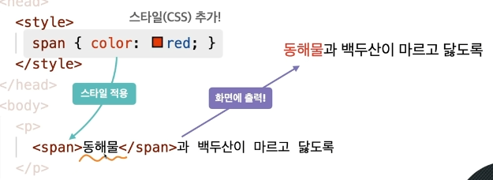
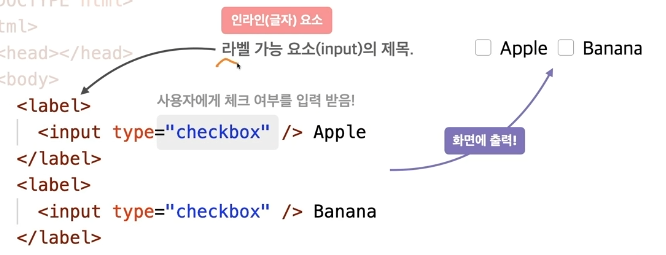
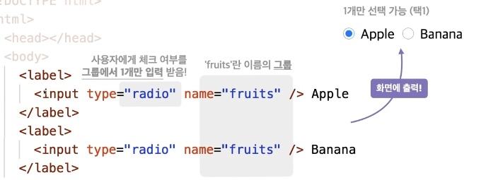

# HTML 이란?
구조를 만드는 언어 이다.

# 핵심정리

## 블록 (상자)요소

- **<div> 특별한 의미가 없는 구분을 위한 요소(dividion)**
- **<h> 제목을 의미하는 요소 (Heading)**
    ```html   
    숫자가 적을수록 거 중요한 제목을  정의 글자 사이즈도 차등 적용 됨
    
    <h1>제목</h1>
    <h2>제목</h2>
    <h3>제목</h3>
    <h4>제목</h4>
    <h5>제목</h5>
    <h6>제목</h6>

    ``` 
       
    `<p>` 문장을 의미하는 요소 (paragraph)**
    - **`<ul>` 순서가 필요 없는 목록의 집합 (Unordered List)**
    - `<li>`**목록 내 각 항목 (List Item)**
        ul과 li 태그는 세트로 사용 된다.        
    - `<ol>` 순서가 필요한 목록의 집합

인라인 (글자)요소

- **` `이미지를 삽입하는 요소(Image)**
    - src = 경로를 설정
    - alt = 이미지의 이름을 설정
- **`<a href=" http://naver.com">`네이버 다른/같은 페이지로 이동하는 하이퍼링크를 지정하는 요소(Anchor)**

- **`<a href=" " target=" ">`**
    <br />href = 링크 URL
    <br />target =  링크 url의 표시(브라우저 탭 위치)
    <br />_blank = 새탭에 표시
    



- **`<span>` 특별한 의미가 없는 구분을 위한 요소 vs`<div>`**
- **`<br/>` 줄바꿈 요소 (Brack)**





- **`<label>` 라벨 가능 요소 (input)의 제목.**
    
    `<input type="checkbox" cheked/>`<input type="checkbox" cheked/> cheked 체크박스 미리 체크됨 상태
    
    묶인 체크중 하나만 선택 하는 방법
    **name** 이라는 구분 분류로 묶어 사용한다.
    

## 인라인 요소 이면서 블럭요소 =(inline-block)

- **`<input type = " " value=" "/>` <input type = " " value=" "/> 사용자가 데이터를 입력하는 요소**
    
    "text" 텍스트 (입력 받을 타입)
    <br />value=" " 미리 입력된 값 (데이터)
    <br />placeholder = " " 사용자가 입력할 값(데이터)의 힌트
    <br />disabled 입력요소 비활성화(입력할수 없는 상태)
    

## 테이블 요소

- **`<table>` 표요소, 행(Row)과 열(Columm)의 집합**
    
    `<tr> `행을 지정하는 요소 (Table Row)
    `<td>` 열을 지정하는 요소 (Table Data)
    <br />colspan="2" 2칸 병합
    

## 주석달기

- <!— 주석내용—>
<br />수정 사항이나 설명 등을 작성
<br />컨트롤 슬러시  단축키로 사용 가능하다.
<br />css  = /* */

## 전역속성

- 전체 영역에서 모두 사용 할 수 있는 속성
- title=" " 요소의 정보나 설명을 지정 (마우스를 대면 보임)
- style="스타일" 요소에 적용할 스타일(css)를 지정
- class=" 이름 "  요소를 지칭하는 이름
    <br /> - css 에서는 .이름으로 설정해야 스타일 변경 가능
- id="이름" 요소를 지칭하는 고유한 이름
    <br />id 는 중복되게 사용하면 안된다.
    <br /> - 이름 으로 css 에서 속성 스타일 변경 가능
        
- bata-이름="데이터" 요소에 데이터를 지정
    <br />- js 작업    
    ```js
    HTML  <script defer src="./main.js"></script>
    			
    			<div data-fluit-name="apple">사과</div>
    
    const els = document.querySelectorAll('div')
           els.forEach(el ⇒ {
          console.log(el.dataset.fruitName)
    })
    ```
    

# HTML 기본문 해석

```
💡 **<!DOCTYPE html>**= 문서의 html 버전을 지정
```
⭐항상 **index.html**을 파일 최상단에 위치해야 함

현재는  html5 버전이다. = 웹 브라우저가 어떤 html 버전으로 해석하여 페이지를 이해하는지  알려주는 방법
**`<!DOCTYPE html PUBLIC "-//dkdf//dsfa">`**  = XHTML 이전 버전
<br />**`<html> </html>`** = 문서의 전체  범위를 나타냄 
<br />**`<head> </head>`** = 문서의 정보를 나타내는 범위 (눈에 보이지 않는 정보)
<br />**`<body> </body>`** = 문서의 구조를 나타내는 범위  (보여지는 구조 (로고 헤더 푸터 네비게이션,메뉴,버튼 이미지))
<br />**`<title> </title>`** = 문서의 제목을 정의(탭에 보이는 제목)
<br />**`<meta> </meta>`** 페이지의 제작자,내용 ,키워드 같은 정보를  검색엔진이나 브라우저에 제공
name = 정보의종류 content = 정보의 값
<br />`<meta name="viewport" content="width=device-width, initial-scale=1.0">`
"viewport" = 모바일 장치에만 해당 ,데스크탑엔 해당되지 않음
initial-scale=1.0" = 1.0배로 출력

`<meta charset="UTF-8">` 문자의 인코딩 방식
EUC-KR 문자의 인코딩 옜방식 (나중에 찾아볼것) 


## ○기본 내용 수정 방법

### ⭐페이지 기본 언어 설정

`<html lang="en">` 홈페이지의 기본 언어 확인 ko = 한국어

### 😀 태그 연속 생성

`div>ul>li*4{$}`
$ = 숫자 순서

    ```html
    <div>
        <ul>
            <li>1</li>
            <li>2</li>
            <li>3</li>
            <li>4</li>
        </ul>
    </div>
    ```

### 페이지 추가 방법

`<a href="../about/about.html">About</a>`


### 이미지 삽입

``
<br />이미지의 경로 삽입 alt 속성으로 무조건 작성(대체 텍스트)

## ⭐CSS 설정

main.css 파일을 생성

### CSS파일을 링크 하는 법

`<link rel="stylesheet" href="./main.css">`
<br />link > TAP > ./ > main.css 첨부 (css 파일을  링크 하는 법)
<br />rel = 가져올 문서와의 관계 href = 가져올 문서의 경로

### ICON 을 링크 하는 법

`<link rel="icon" href="./favicon.png">`
<br />icon 을 링크 하여 브라우저 탭에 표시가  가능하다.
<br />favicon (파비콘) = 페이지를 대표하는 이미지

### 문서 내의 스타일  지정

```css
<style> 
	div {
		text-decoration: underline;
			}
</style>
```

선언 방식의 차이가 있으며  직접 선언이 우선 시 된다.
    직접 하거나 css 로 링크하여 사용

### CSS 로 이미지를 불러오기

```css
div{
	width: 500px;
	height: 500px;
	background: url("../images/logo.png");
}
```

### 💭기본 CSS 설정 초기화

css 파일 링크 전단에
<br />`<link rel="stylesheet" href="[https://cdn.jsdelivr.net/npm/reset-css@5.0.1/reset.min.css](https://cdn.jsdelivr.net/npm/reset-css@5.0.1/reset.min.css)">`
<br />을 불러넣어  기존 css값  초기화 하고 시작할것!!

**코드 펜** 에서는 CSS Base 값 에서  Reset 설정 시 초기화가 된다.

## ⭐자바 설정

main.js 자바 파일을 생성
<br />console.log('HEROPY!') (콘솔에  문자를 남김)
<br />F12 에서 console 탭에 가면  확인 가능

### JS 연결방법

`<script src = "./main.js"></script>` 태그로 자바 링크 걸수 있음  css 와는 다르게  연결됨
<br />src 를 사용함 (외부의 자바파일을 가져오는 경우)
<br />`<script>`만 사용 할 경우  문서 내부에서  작성도 가능하다

## 경로 확인 방법

⭐경로 입력시 ./ = 주변에 라는 뜻을 말함

``
<br />불러오기가 아닌 직접입력 방법

##상대 경로 vs 절대 경로

./ (생략가능)  http(https) 원격
<br />../       / (//)
<br />상위폴더     최상위 경로 (루트)

./    근처파일
<br />../   상위파일
<br />/     최상위 파일
<br />//

페이지 주소 를 확인

[http://127.0.0.1:5500/stater/test/index.html](http://127.0.0.1:5500/stater/test/index.html)
<br />포트 번호가 5500이란것을 확인할수 있다
<br />파란색 상태바에 go Live를 누르면 접속가능
<br />혹은  localhost:5500 을 입력 하면 접속이  가능하다.
<br />포트번호가 달라지면 호스트도 달라진다.

HTML 특수문자
https://dev.w3.org/html5/html-author/charref
특수문자가 정리된 파일은 나중에 확인할 일이 생길것 같다.