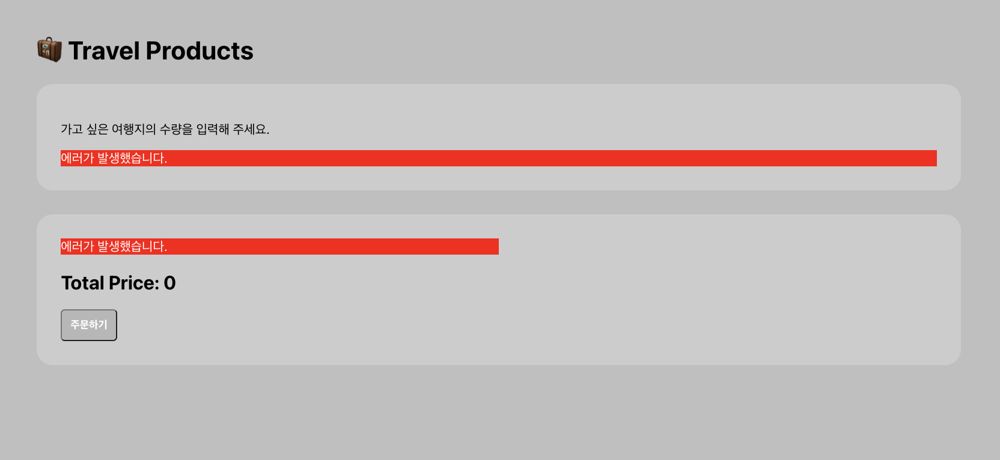
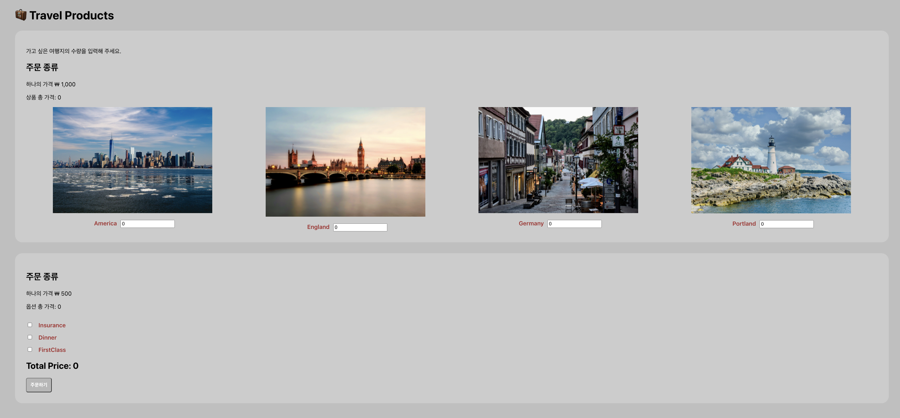
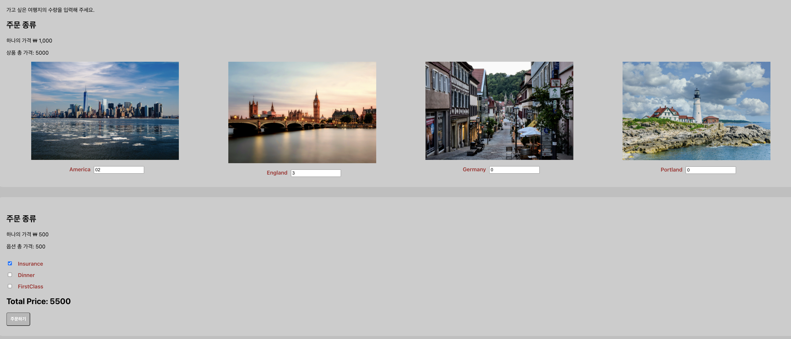
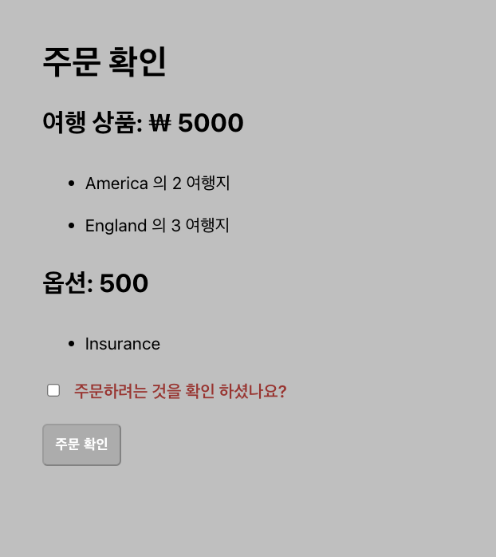
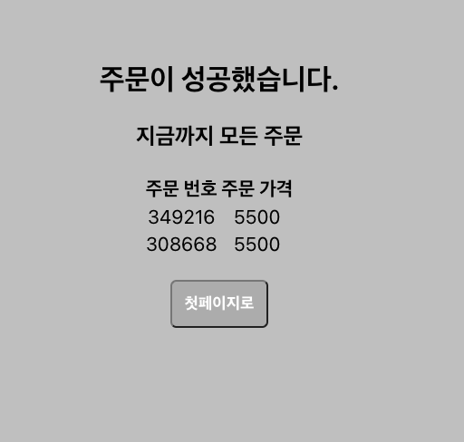

# React-shop-test

[https://www.inflearn.com/course/따라하는-리액트-테스트/dashboard](https://www.inflearn.com/course/%EB%94%B0%EB%9D%BC%ED%95%98%EB%8A%94-%EB%A6%AC%EC%95%A1%ED%8A%B8-%ED%85%8C%EC%8A%A4%ED%8A%B8/dashboard)

## 리액트 테스트 실습 문제

### jest 파일 구조와 MSW 를 횔용한 프로젝트 였다.

- jest 란 FaceBook에 의해 만들어진 테스팅 프레임 워크로 최소한의 설정으로 동작하고, 테스트 케이스로 어플리케이션이 잘 돌아가는지 확인해주는 기능이다.

- MSW 란 **Mock Service Worker의 약자로** 브라우저에 서비스 워커를 등록하여 외부로 나가는 네트워크 리퀘스트를 감지하고 그요청을 중간에 가로채서 핸들러의 ****의한 응답으로 처리해 브라우저로 보내주는 역할로 사용된다.

[react-shop-server.zip](https://s3-us-west-2.amazonaws.com/secure.notion-static.com/62c358c2-cadd-4ab5-b31d-f233c86b966e/react-shop-server.zip)

위에 해당 파일을 실행해야 프로젝트를 구성할수 있었다.

해당 프로젝트는 5000번 포트를 사용하고 

작업 프로젝트는 3000 번 포트를 사용하고 있다.

만약 5000번 포트인 서버를 실행 하지않는다면 자료를 받아올수 없기 때문에



위 사진과 같은 에러가 발생한다.

## 테스트 구현

```jsx
my tree

--react-shop-test--
|- node_modules
|- public
|- src
	|_ components
		|_ErrorBanner.js
	|_ context
		|_OrderContext.js
	|_ mocks
		|_ handlers
		|_ server
	|_ pages
		|_ CompletePage
				|__ ...
		|_ OrderPage
				|__ ... 
		|_ SummaryPage
				|__ ...
	|_ App.css
	|_ App.js
	|_ App.test.js
	|_ index.js
	|_ reportWebVitals.jsreportWebVitals
	|_ setupTests.js
	|_ test-utils.js
|- package-lock.json
|-package.json
```



css 와 기본 내용을 수정하여 만들어 보았다

test.js 로 중간중간의 결과 값을 테스트 하며 만들었는데

```jsx
// 여행지 추가
		const americaInput = await screen.findByRole("spinbutton", {
        name: "America",
    });
    userEvent.clear(americaInput);
    userEvent.type(americaInput,'2');

    const englandInput = await screen.findByRole('spinbutton', {
        name: "England",
    });
    userEvent.clear(englandInput);
    userEvent.type(englandInput,"3");
// 옵션 추가
    const insuranceCheckbox = await screen.findByRole("checkbox", {
        name: "Insurance",
    });
    userEvent.click(insuranceCheckbox);
// 결과
    const orderButton = screen.getByRole("button", {
        name: '주문하기',
    });
    userEvent.click(orderButton);
```

각각의 여행지의 수량을 입력하고 옵션을 선택 하는 것에 따라 결제 금액이 변동된다.



해당 상황에서 주문하기 버튼을 누르면



다음 페이지로 넘어가며 해당 선택항목에 따른 결과 값이 뜨게되는데

주문 수량 확인을 체크 해야 주문 확인 버튼이 활성화 되어 클릭이 가능 해진다.

주문 확인이 끝나면 주문에 대한 결과 값이 주문 리스트에 꽂히고

그결과



와 같이 출력 되며 첫페이지로 가면 기존의 홈이 나오게 된다.

현재 주문번호가 2번 생성되는 버그가 있어 위치를 파악하고 수정하는 작업 중에 있다. 

### 연습 하며 느낀점

_  테스트케이스를 작성하면서 결과 값을 보면서 하다보니 이해하기 쉬웠다.

_ 테스트 케이스 작성시 해당 문건의 띄어쓰기, 사용한 단어가 틀릴경우 오류가 발생한다.

ex > 옵션 금액 이라는 문자를 적용 하였을 때

옵션금액 과 같이 띄어 쓰기를 하지 않거나, 옵션 가격과 같이 문구를 바꾸면 안된다.

_  외부 포트에서 받아오는 방법은 조금 더 연습해야 한다.

외부포트에서 받아오는것을 같은 방식으로는 만들수 있겠지만 직접 구현하는것에 있어서

어려움이 있다.

_  useContext, useEffect, useState 이 세가지는 자주 사용되는것 같음으로 예제 많이 풀어봐야 한다.