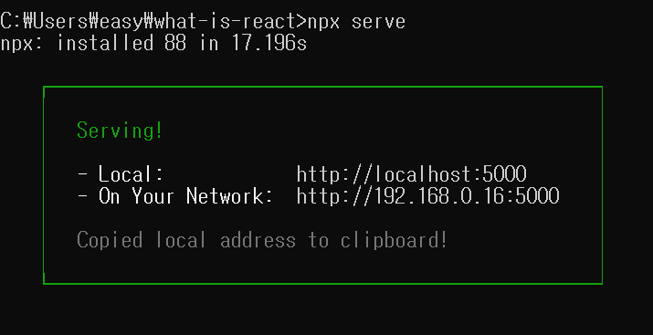

# React 생성

1. mkdir test-react
    mkdir는 폴더를 만들때 사용한다. test-react 라는 폴더를 만들었다.
2. cd what-is-react
3. npm init -y
4. npx serve



# React Component 만드는 법

### *Class Component

```js
{import React feom 'react';

//정의
class ClassComponent extends React.Component{
    render() {
        return (<div>Hello</div>);
    }
}
// 사용 
<ClassComponent />}
```