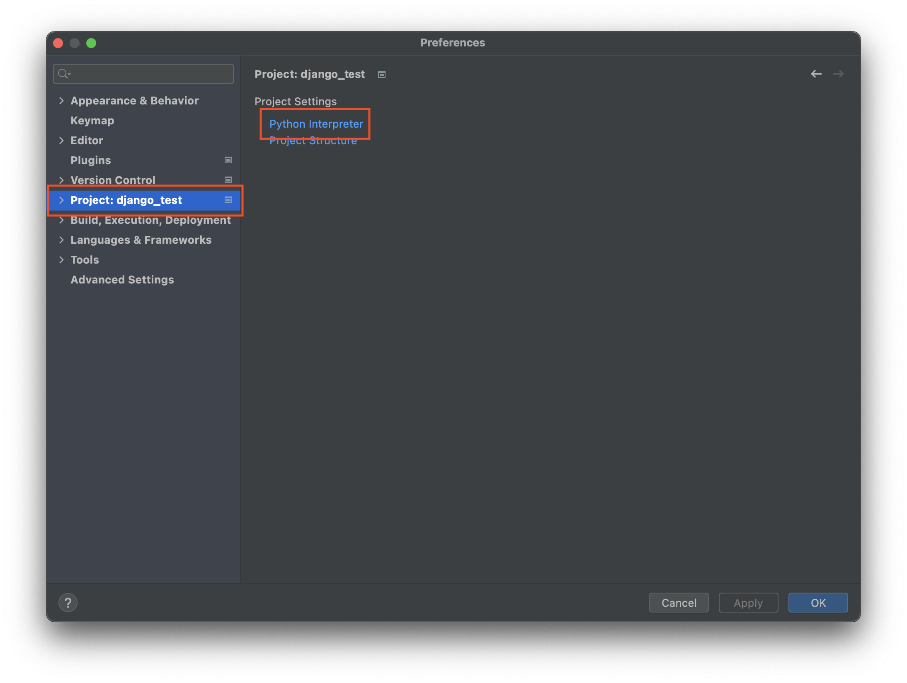
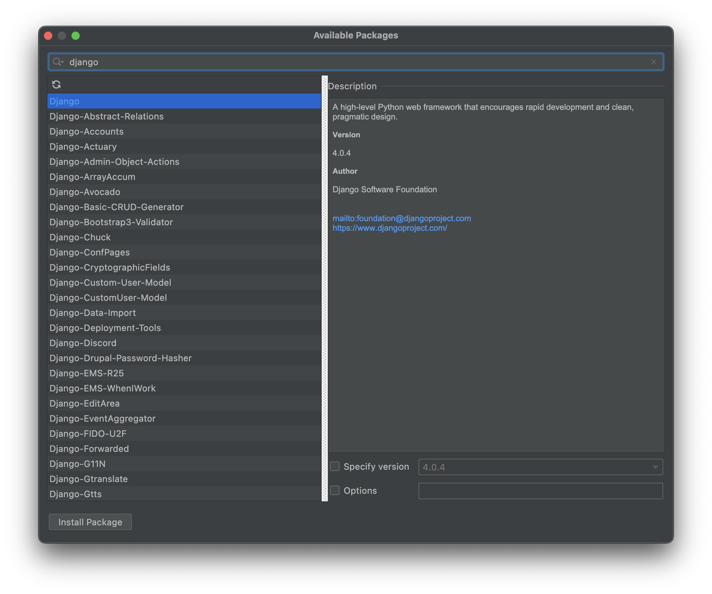
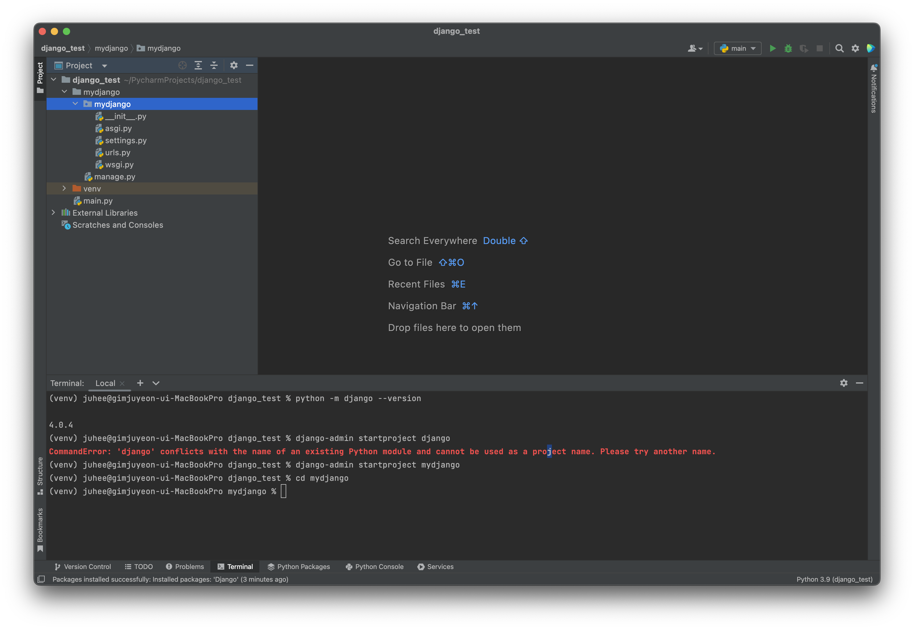
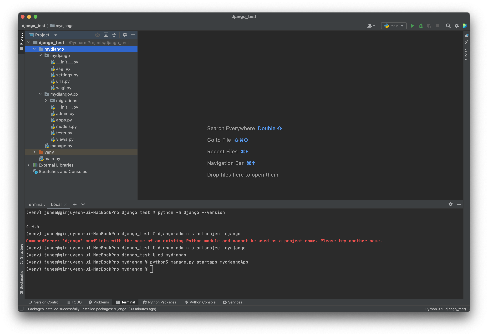
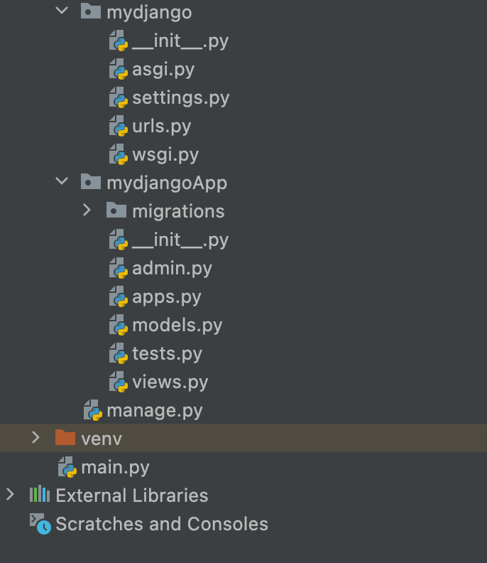
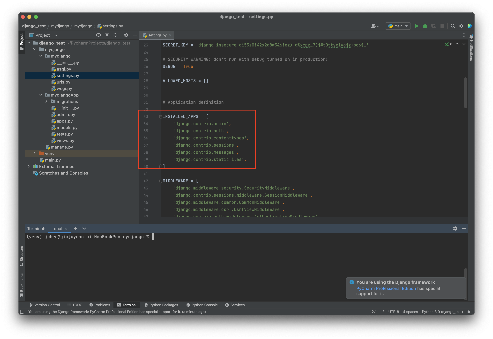

장고를 시작해보자 <br />
우선 장고에 있어서 필요한것은 파이썬 이라는 언어이다.<br />
https://www.python.org/ 페이지에 접속 해서 파이썬을 최신 버전으로 다운로드 받는다.

연습은 파이참이라는 프로그램 으로 진행해 볼 예정이다.
<br />
새 프로젝트를 만들고 장고를 다운로드 받는다.


프로젝트 내부에 interpreter 관리에 들어가보자!


왼쪽 상단에 + 버튼을 누르면 위와 같은 창이 뜨고 검색창에 장고를 검색 하면 된다.<br />
장고가 보이면 왼쪽 하단의 install을 누르도록 하자!
물론 터미널에 `pip3 install django` 라고 입력하는 경우도 가능하다.
<br />


이로써 기본 준비는 완료 되었다.<br />
프로젝트를 만들어보자!



`python -m django --version` 을 입력 하면 장고의 버전을 확인 할수 있다.

**`django-admin startproject myproject_name`** myproject_name 에 내가 정한 프로젝트 이름을 입력하면 프로젝트가 생성 되고 아래와 같은 트리를 가진 파일이 생성 된다.

**만약 프로젝트의 이름을 django로 입력할 경우** 파이썬의 기존 모듈이름과 중복되어 충돌한다는 안내문과 함께 이름을 바꾸라는 경고가 뜨게 된다.

그래서 나는 mydjango 라는 프로젝트로 시작 하였다.
 
``` text
mydjango/
    manage.py
    mysite/
        __init__.py
        settings.py
        urls.py
        asgi.py
        wsgi.py
```
이제 프로젝트에 app을 만들어보자!


App 생성하는데에는 3가지 방법이 있다.

1. Django-admin <command> [options]
2. python manage.py <command> [options]
3. python -m django <command> [options]
```
$ django-admin startapp [App 이름]
$ python manage.py startapp [App 이름]
$ python -m django startapp [App 이름]
```
그중 내가 사용한 방법은 2번 `python manage.py startapp [App 이름]` 이다.
 
위와 같은 트리가 만들어 졌다.

### Django Project 내용
+ mydjango - 프로젝트 전체 구성을 설정하는 곳(여러 앱관리)

+ mydjangoApp - 내가 실제로 개발할 앱의 내용이 들어가는 곳이다.

생성된 파일 내부의 내용을 들여다 보면

* app - App 에 대한 설정을 하는 
* models - 데이터 모델을 생성 하고 수정하는 곳
* views - Web Routing & API 가 저장되는곳
* admin - 어드민 페이지 이다.

앱을 생성을 완료 하였으면 APP을 프로젝트와 연결하는 작업이 필요하다.
 
`settings.py`의 INSTALLED_APPS 에 다음과 같이 추가해야 한다.
'mydjangoApp.apps.MydjangoappConfig' `내앱이름.apps.프로젝트의 클래스 이름` 으로 프로젝트의 이름은 apps.py의 내용에서 확인이 가능하다

다음은 모델을 생성하는 방법을 알아보도록 한다.