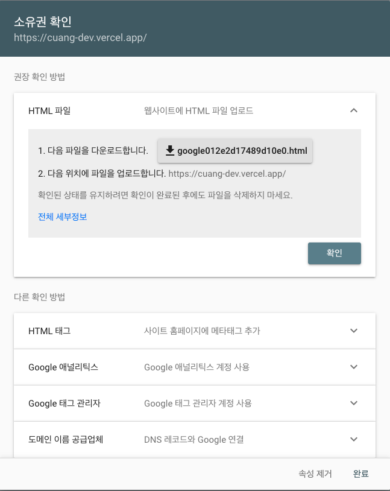

# SEO 란?

SEO(검색 엔진 최적화)는 웹사이트가 검색 결과에 더 잘 보이도록 최적화하는 과정이다. 검색 랭크 개선이라고도 한다. 

## Google search Console
  google에서 검색을 하였을 때, 나의 사이트가 보여질 수 있도록 등록하는 Google의 서비스이다.

1. 구글 검색창에 "Google search Console" 을 검색하여 해당 사이트에 접속!

2. 시작하기를 선택한다.

3. 화면으로 변경되는데 url을 지정하여 사용하고 싶다면 도메인을 구매하여야 하므로 
왼쪽의 `도메인`을  
github 에서 제공 되는 url 을 그대로 사용 할 경우 `url접두어` 를 선택하면 된다.
 선택 하고자 하는 곳에 내가 적용 하고자 하는 페이지의 주소를 입력한 후 계속을 눌러준다.

인증 중 이라는 로딩이 지나가면 아래와 같은 페이지가 뜬다.

- HTML 파일 : 웹사이트에 HTML 파일 업로드 (권장)
- HTML 태그 : 사이트 홈페이지에 메타태그 추가
- Google 애널리틱스 : Google 애널리틱스 계정 사용
- Google 태그 관리자 : Google 태그 관리자 계정 사용
- 도메일 이름 공급업체 ; DNS 레코드와 Google 연결

5가지 방법 중에 내가 하고자 하는 방식을 선택 나는 

보류 <조금 더 연구하기!>