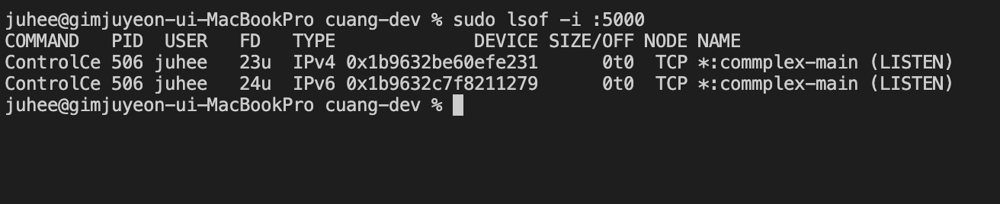
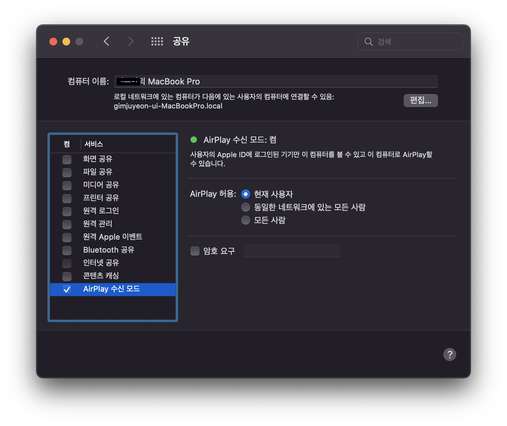

오늘은 리엑트 프로젝트를 연습하며 있었던  문제를 적어보려 한다.

## 문제: 이미 사용중인 포트일경우

https://www.inflearn.com/course/따라하는-리액트-테스트/dashboard 의
react-shop-test 실습 문제를 따라 하다 보니 생긴 문제 이다.
해당 주어진 서버가 5000번 포트로 실행해야 3000번 포트에서 실행되었던 프로젝트의 자료를 가져 올수 있었는데
5000번 포트를 이미 사용 중이라서 불러 올수 없었다.

이떄 사용할수 있는 명령어는  `sudo lsof -i :5000`
어떤 프로세스가 사용중인지 확인 할수 있다.

이때 나의 PID 번호는 506 이고 해당 프로세스를 종료할때는
`kill -9 {PID}` 를 입력해 주면 된다.

그런데 나의 경우 해당 프로세스를 종료 해도 다른 프로세스가 실행되었는데
검색을해보니
COMMAND 항목을 참고하면 된다고 한다. 
node가 아닌 ControlCe가 확인되는 것을 알 수 있다.

이를 해결하기 위한 방법은
시스템 환경 설정 - 공유 에서 AirPlay 수신 모드 를 체크 해제해주면 된다고 한다.

해당 체크를 해제 하면 정상적으로 5000번 포트를 사용할수 있게 된다.
macOS를 Monterey로 업데이트해서 발생한 문제라고 하니 맥을 사용할때 주의 하도록 해야 겟다.

참고한 블로그
https://velog.io/@jsy7517/Error-listen-EADDRINUSE-address-already-in-use-5000